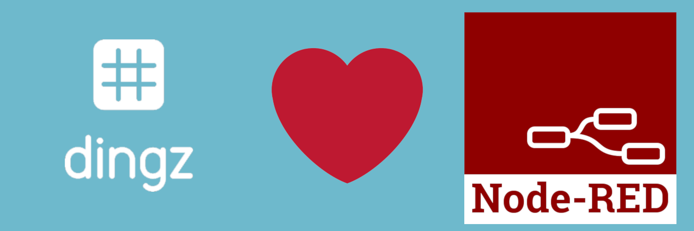

### Features

- Control nodes via JSON input flows or by simply setting the values in the properties menu
- Automatic discovery of dingz devices
- Full functionality of the dingz api (TODO)
- Status message of how the message was sent or if device is reachable

### Installation

dingz-Node-RED was written in **Node.js** v4.2.6 and tested on Node-RED v0.19.4.

To use it execute `npm install node-red-contrib-dingz`.

### Bugs

Please report all bugs through the Github issues page. Your help is greatly appreciated.

### Nodes

- [dingz Input](#dingz-Input)
- [dingz Output](#dingz-Output)

---

#### dingz Input

You can specify which device you are using by selectin the device in the dingz node or specifing it there manually. Done! You can already use your dingz with node-RED!
If you however want to have even more control you can use the advanced configuration to specify a url and data to be sent once you click your button. If you specify no data, an http get request will be executed other a post request. If you use "wire" as address you will use the normal output of the node.
